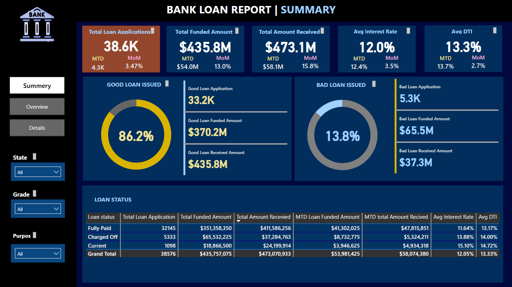
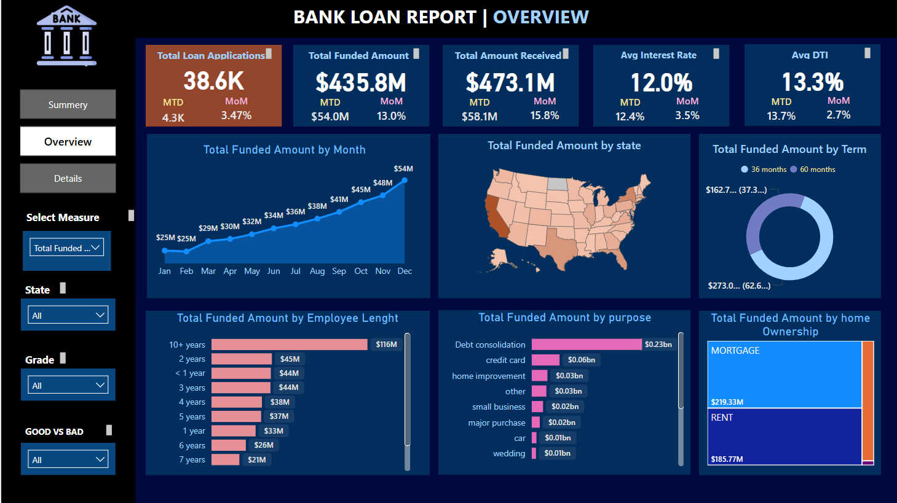
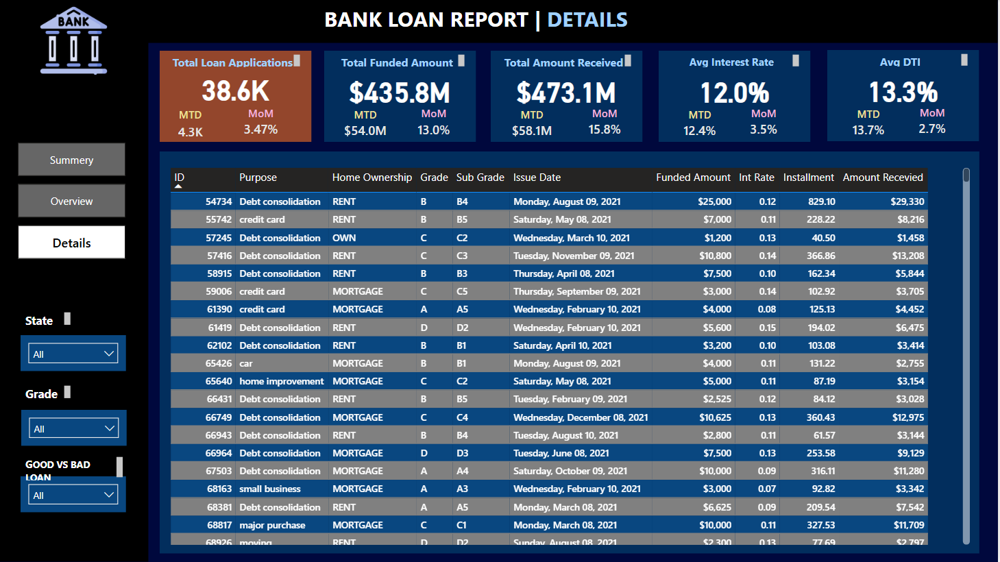

# 📊 Bank Loan Analysis — Power BI Project

## 🔍 Project Overview
This project is a comprehensive **Power BI dashboard** designed to analyze bank loan application data. It demonstrates skills in **Power BI, DAX, Power Query**, and **data storytelling** using a **flat-file CSV** as the data source.

The goal is to uncover trends, monitor KPIs, and assess loan performance to support business decision-making in a data-driven way.

📥 [Download the Power BI file (BANK LOAN.pbit)](BANK%20LOAN.pbit)

---

## 📌 Problem Statement

The analysis addresses the following business questions:

### 📈 Dashboard 1: Summary View
- ✅ Total Loan Applications (including Month-to-Date and Month-over-Month trends)
- 💰 Total Funded Amount (with MTD & MoM comparison)
- 💵 Total Amount Received
- 📉 Average Interest Rate
- 📊 Average Debt-to-Income (DTI) Ratio
- ### 📸 Dashboard Preview

#### Good vs Bad Loan KPIs:
- Application percentage breakdown
- Good vs Bad loan count
- Funded Amount and Received Amount by loan status

### 📍 Dashboard 2: Overview
- 📅 **Monthly Trend** of applications (Line Chart)
- 🗺️ **State-wise Analysis** (Map)
- 🕒 **Loan Term Distribution** (Donut Chart)
- 👷 **Employment Length Distribution** (Bar Chart)
- 🏦 **Loan Purpose Breakdown** (Bar Chart)
- 🏠 **Home Ownership Distribution** (Tree Map)
- 

### 📋 Dashboard 3: Detailed View
A grid view with all essential metrics to filter and search individual loan records. It serves as a drill-down view for detailed loan analysis.

---

## 🛠️ Tools & Technologies Used

| Tool               | Purpose                                  |
|--------------------|-------------------------------------------|
| **Power BI**       | Data modeling, visualization, and DAX     |
| **CSV (Flat File)**| Primary data source                       |
| **Power Query**    | Data transformation & cleanup             |
| **DAX**            | KPI and Time Intelligence calculations    |

---

## 📚 Key Skills Demonstrated

- Data import from CSV and transformation using Power Query
- Time Intelligence using DAX (MTD, MoM)
- Building calculated measures and KPIs
- Slicers, charts, card visuals, and tree maps
- Structured dashboard design for executive reporting
- Interactive filtering and drill-down reports

---

## 📥 Dataset

The dataset is a flat file (CSV) with fields like:
- Loan Amount, Funded Amount, Received Amount
- Loan Status (Good/Bad)
- Issue Date
- Employment Length
- Interest Rate
- State, Loan Purpose, and more

You may replace the dataset with any similar structure for practice or showcase.

---

## ▶️ How to Use

1. Download this repository and open `BANK LOAN.pbix` in **Power BI Desktop**.
2. If using your own CSV, adjust the **data source path** in Power Query.
3. Explore the dashboards using slicers and filters.

---

## 🖼️ Screenshots

  
- 
- 

---

## 📌 Author

**Irfan Shaikh**  
Data Analyst | Power BI Developer  
*This project is part of my data analytics portfolio to showcase end-to-end BI reporting skills.*

---

## ⭐️ If you found this helpful...

Feel free to star ⭐ the repository or share your feedback!

